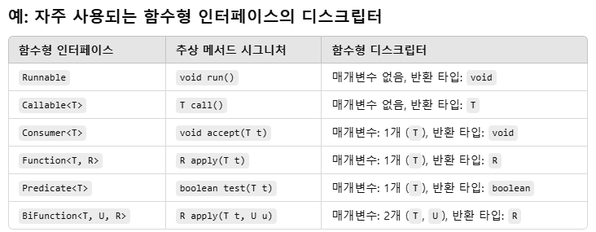

# 람다 표현식
- 람다란?
  - 메서드로 전달할 수 있는 익명 함수를 단순화한 것
- 익명
  - 보통의 메서드와 달리 이름이 없으므로 익명이라 표현
  - 구현해야 할 코드에 대한 걱정거리가 줄어듬
- 함수
  - 람다는 메서드처럼 특정 클래스에 종속되지 않으므로 함수라고 부름
  - 메서드처럼 파라미터 리스트, 바디, 반환 형식, 가능한 예외 리스트를 포함
- 전달
  - 람다 표현식을 메서드 인수로 전달하거나 변수로 저장할 수 있음
- 간결성
  - 익명 클래스처럼 많은 자질구레한 코드를 구현할 필요가 없음

```java
// 람다 식 이전 기존 코드
Comparator<Apple> byWeight = new Comparator<Apple>() {
      @Override
      public int compare(Apple a1, Apple a2) {
            return Integer.compare(a1.getWeight(), a2.getWeight());
      }
};
```

```sql
// 람다식을 이용한 코드
Comparator<Apple> byWeight2 = (Apple a1, Apple a2) -> Integer.compare(a1.getWeight(), a2.getWeight());
```

- 람다 표현식은 파라미터, 화살표, 바디로 이루어짐
  - 파라미터 리스트
    - Comparator 의 compare 메서드 파라미터 (사과 두 개)
  - 화살표
    - 화살표 (->) 람다의 파라미터 리스트와 바디를 구분
  - 람다 바디
    - 두 사과의 무게를 비교
    - 람다의 반환 값에 해당하는 표현식

- 자바 8의 유효한 람다 표현식 6가지
```java
(String s) -> s.length()
(Apple a) -> a.getWeight() > 150
(int x, int y) -> {
    System.out.println("Result: ");
    System.out.println(x + y);
}
() -> 42
(Apple a1, Apple a2) -> a.getWeight().compareTo(a2.getWeight());
```
## 함수형 인터페이스
- 정확히 하나의 추상 메서드를 지정하는 인터페이스
- 많은 디폴트 메서드가 있더라도 추상 메서드가 오직 하나면 함수형 인터페이스

### 함수형 인터페이스로 뭘 할 수 있을까?
- 람다 표현식으로 인터페이스의 추상 메서드 구현을 직접 전달함
- 전체 표현식을 함수형 인터페이스의 인스턴스로 취급
- 함수형 인터페이스보다는 덜 깔끔하지만 익명 내부 클래스로도 같은 기능 구현 가능

## 함수 디스크립터
- 시그니처(Signature): 메서드의 매개변수 타입과 반환 타입을 나타내는 정보
- 람다 표현식은 함수형 인터페이스의 추상 메서드 시그니처에 따라 작성
  - 예를 들어, Runnable의 run() 메서드는:
  - 매개변수 없음
  - 반환 타입: void
  - 따라서, 람다 표현식도 이런 시그니처를 따라야 함
```java
Runnable task = () -> System.out.println("Running!");
```
- 함수형 디스크립터는 람다 표현식의 시그니처를 서술하는 함수형 인터페이스의 추상 메서드 시그니처를 말함


- @FunctionalInterface 는 무엇인가?
  - 새로운 자바 API를 살펴보면 함수형 인터페이스에 @FunctionalInterface 어노테이션이 추가
  - @FunctionalInterface는 함수형 인터페이스임을 가리키는 어노테이션
  - 함수형 인터페이스가 아니라면 컴파일러가 예외를 발생시킴

## 람다 활용 : 실행 어라운드 패턴
- 자원 처리

```java
import java.io.BufferedReader;
import java.io.FileReader;

public String processFile() throws Exception {
  try (BufferedReader br = new BufferedReader(new FileReader("data.txt"))) {
      return br.readLine(); // 실제 필요한 작업을 하는 행
  }
}
```

### 동작 파라미터화를 기억하라
- 현재 코드는 파일에서 한 번에 한 줄만을 읽을 수 있음
- 기존의 설정, 정리 과정은 재사용하고 processFile 메서드만 다른 동작을 수행하도록 명령할 수 있다면 좋을 것
- 효율적인 방법으로는 
  - processFile의 동작을 파라미터화 하는 것
  - 람다를 통해 동작을 전달할 수 있음
```java
String result = processFile((BufferedReader br) -> br.readLine() + br.readLine());
```

### 함수형 인터페이스를 이용하여 동작 전달
- 함수형 인터페이스 자리에 람다를 사용할 수 있음

```java
import java.io.IOException;

@FunctionalInterface
public interface BufferedReaderProcessor {
  String process(BufferedReader b) throws IOException;
}
```

```java
public String processFile(BufferedReaderProcessor p) throws IOException {}
```

### 동작 실행

```java
import java.io.BufferedReader;
import java.io.FileReader;

public String processFile(BufferedReaderProcessor p) throws IOException {
  try (BufferedReader br = new BufferedReader(new FileReader("data.txt"))) {
      return p.process();
  }
}
```

### 람다 전달

```java
import java.io.BufferedReader;

String oneLine = processFile((BufferedReader br) -> br.readLine());

String twoLInes = processFile((BufferedReader br) -> br.readLine() + br.readLine());
```
