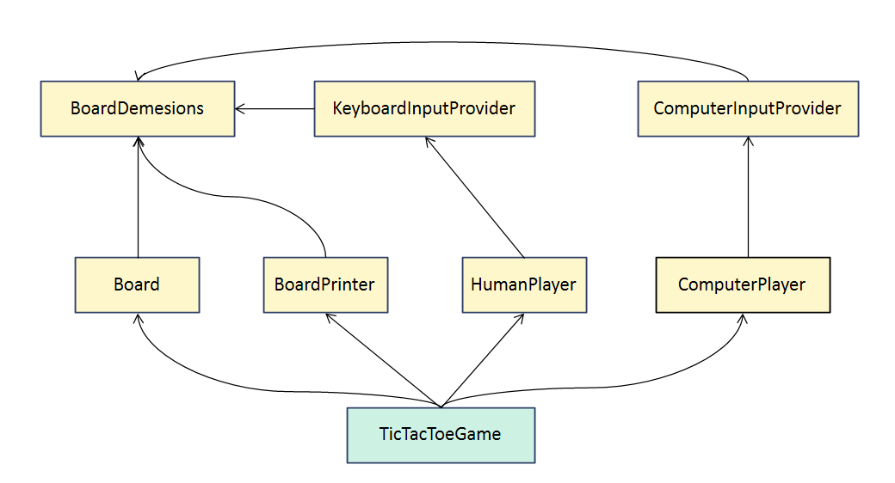

# 제한된 클래스 인스턴스화 - 자동 의존성 주입 구현
## Package - Private classes Instantiation using Constructor Class
### Public classes vs Package-Private classes
- Public 예시
  - public 클래스는 모든 다른 클래스에게 접근 가능하고 보인다
```java
package some.package;

// Can be accessed from inside the package
public class PublicClass {
    ...
    public PublicClass() {
        ...
    }
}
```
- Package-Private classes
  - 접근 수정자가 빠져 있으면 클래스는 패키지로 간주되어 비공개가 되며, 그 패키지 내의 클래스들만 접근할 수 있다
  - 패키지 비공개 클래스(Package-Private classes)는 패키지 외부 사용자로부터 내부 클래스를 제한하여 패키지 외부 API를 나타내는 클래스만 가시적으로 유지함으로써 혼란을 방지하는 좋은 방법
  - 패키지 외부에서 패키지 비공개 클래스에 접근을 허용해야 하는 경우가 있다
    - Reading
    - Initializing
  - 일반적으로 외부 라이브러리를 사용하여 이러한 클래스를 초기화할 때 패키지 비공개 클래스에 접근을 허용해야 한다
  - 외부 라이브러리의 코드는 우리 패키지 외부에 있기 때문이다
```java
package some.package;
// Cannot be accessed from outside the package
class PublicClass {
    ...
    public PublicClass() {
        ...
    }
}
```
### Package-Private classes Creation

```java
public Object createClassInstance(Constructor<?> packagePrivateClassCtor, Object ...ctorArgs) {
    packagePrivateClassCtor.setAccessible(true);
    return packagePrivateClassCtor.newInstance(ctorArgs);
}
```
## External Package - Private classes access use cases
### Parsing to/from Java Objects
```text
- bestprice
    ㄴ BestPriceApi.java
       HttpClient.java
       Request.java
       Response.java
```
- 모든 클래스가 담긴 Java 패키지가 있다고 가정
```java
package bestprice;

public class BestPriceApi {
    private final HttpClient client;
    ...
    public float getBestPrice(String product) {
        ...
    }
}
```
- BestPriceApi 클래스는 제품의 최저가를 찾는 기능을 제공하며, 이는 사용자가 bestprice 패키지를 사용할 때의 진입점이 됩니다
- 나머지 클래스는 내부 패키지의 비공개 클래스뿐만 아니라 외부 라이브러리도 사용하여 JSON과 같은 프로토콜을 이용하여 외부 서비스와 통신합니다.
```java
package bestprice;

class HttpClient {
    
}

class Request {
    
}

class Response {
    
}
```
- 단일 서비스와 통신하기 위한 코드는 다음과 같을 것
```java
package bestprice;
import com.fasterxml.jackson.databind.ObjectMapper;

class HttpClient {
    private final ObjectMapper objectMapper;
    
    public float getPriceFromService() {
        Request request = buildRequest();
        byte[] requestData = objectMapper.writeValueAsBytes(request);
        byte[] responseData = sendHttpRequest(requestData);
        Response response = objectMapper.readValue(requestData, Response.class); // package-private class
        response.getPrice();
    }
}
```
- 설명
  1. 먼저, 우리는 외부 서비스로 요청을 나타내는 객체를 생성합니다.
  2. 이 요청 객체를 JSON 이진 표현으로 변환하기 위해 외부 라이브러리를 사용해야 합니다.
    - 그러나 이 요청 객체가 패키지 비공개 클래스의 객체임에 유의해야 합니다.
    - 따라서 다른 패키지에 있는 외부 라이브러리는 이 요청 객체를 분석하기 위해 리플렉션만을 사용할 수 있습니다.
  3. 그런 다음 JSON 형식으로 요청 데이터를 전송하면, 이에 대한 이진 형식의 JSON 응답을 받게 됩니다.
  4. 이러한 바이트 영역으로는 직접 작업하기가 어렵기 때문에 이 데이터를 자바 객체로 역직렬화해야 합니다.
  5. 이를 위해 다시 한 번 외부 라이브러리를 사용하며, 여기서도 외부 라이브러리는 리플렉션을 통해 패키지 비공개 클래스의 객체를 초기화할 수 있습니다.
    - 이 모든 과정은 Java 리플렉션의 능력 덕분에 가능합니다

### Dependency Injection
- 다른 패키지에서 패키지 내부 클래스의 인스턴스화
- 애플리케이션 시작시 객체의 자동 생성

## Dependency Injection Implementation
### Tic Tac Toe Game - Dependency Injection
- 틱텍토 게임을 객체지향으로 구현해보자

- TicTacToeGame 객체를 기준으로 생성자를 재귀적으로 호출하면서 Game에 필요한 객체들을 생성한 다음
- 게임을 시작하는 구조로 되어 있다
- 세부적인 로직은 알 필요는 없고 다음과 같은 설명을 들으면 이해가 될 것이다.
```java
public class Main {
    public static void main(String[] args) throws InvocationTargetException, InstantiationException, IllegalAccessException {
        Game game = createObjectRecursively(TicTacToeGame.class);
        game.startGame();
    }

    public static <T> T createObjectRecursively(Class<T> clazz) throws InvocationTargetException, InstantiationException, IllegalAccessException {
        Constructor<?> constructor = getFirstConstructor(clazz);

        List<Object> constructorArguments = new ArrayList<>();

        for (Class<?> argumentType : constructor.getParameterTypes()) {
            Object argumentValue = createObjectRecursively(argumentType);
            constructorArguments.add(argumentValue);
        }

        constructor.setAccessible(true);
        return (T) constructor.newInstance(constructorArguments.toArray());
    }

    public static Constructor<?> getFirstConstructor(Class<?> clazz) {
        Constructor<?>[] constructors = clazz.getDeclaredConstructors(); // 생성자 목록이 넘어온다
        if (constructors.length == 0) {
            throw new IllegalStateException("No constructor has been found for class %s".formatted(clazz.getName()));
        }
        return constructors[0];
    }
}
```
- TicTacToeGame의 생성자는 TicTacToeGame의 생성자 목록으로는 [Board, BoardPrinter, HumanPlayer, ComputerPlayer]
  - for문을 돈다
    1. Board
       - 내부적으로 필요한 인스턴스를 생성하여 constructorArguments에 넣는다
    2. BoardPrinter
       - 1번과 동일한 방식
    3. HumanPlayers
       - 1번과 동일한 방식
    4. ComputerPlayers
       - 1번과 동일한 방식 
  - 최종적으로 constructorArgument에는 모든 게임에 필요한 객체가 생성되어, game이라는 객체에 담긴다
  - Game 인터페이스는 구현체인 TicTacToeGame을 담게 되고
  - startGame()으로 게임을 시작한다